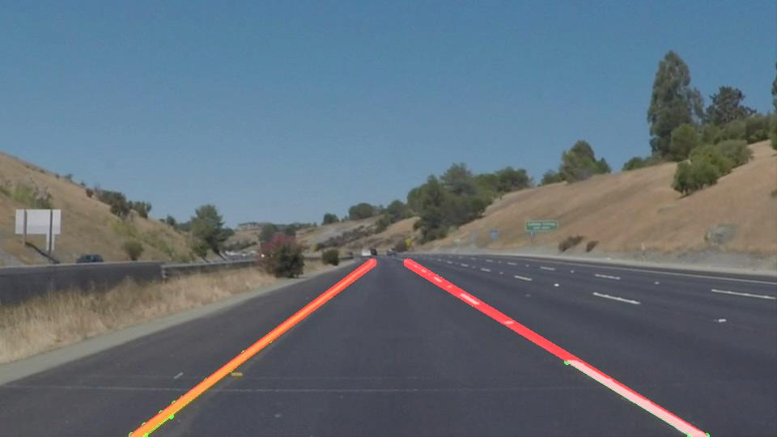

# **Finding Lane Lines on the Road** 

Overview
---

This project is the submission for Project#1 "Finding Lane Lines" of the Udacity's Self Driving Nano-Degree course. Source repo - https://github.com/udacity/CarND-LaneLines-P1

When we drive, we use our eyes to decide where to go. The lines on the road that show us where the lanes are act as our constant reference for where to steer the vehicle. Naturally, one of the first things we would like to do in developing a self-driving car is to automatically detect lane lines using an algorithm.

This project detects lane lines in images & videos using Python and OpenCV.

**The writeup about the implementation is [available here](./writeup.md.)**

## Getting Started

### Pre-requisites

* Python 3+
* Visual Studio Code

### Setup

If using Anaconda, follow [this guide](https://github.com/udacity/CarND-Term1-Starter-Kit/blob/master/doc/configure_via_anaconda.md)

For bare-bones Python 3, install the required dependencies by running

    $ pip install -r requirements.txt

## Usage

### Jupyter Notebook

`P1.ipynb` contains the implementation of the image processing pipeline for detecting lanes.
The notebook will generate two directories `test_images_output/` and `test_videos_output/` containing the output of the pipeline.

To open the `P1.ipynb` Jupyter Notebook, simply run the following and open the notebook file in Jupyter browser file explorer

    $ jupyter notebook

### Visualiser tool

<video><source src="https://giant.gfycat.com/WastefulDemandingGemsbuck.mp4"></source></video>

This tool will help visualise the changes made in the hyper-parameters of the Image Processing pipeline. The tool DOES NOT write to any file.

To run the visualiser tool, run the following

    $ python visualiser.py

By default it will load 4 images from `test_images/` directory.
Press `Q` to quit the tool.

## License

[MIT (Udacity)](./LICENSE)
