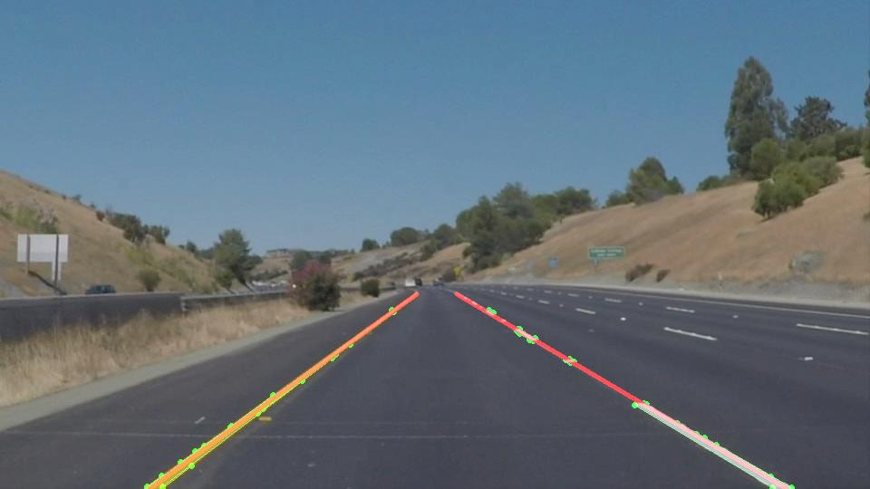
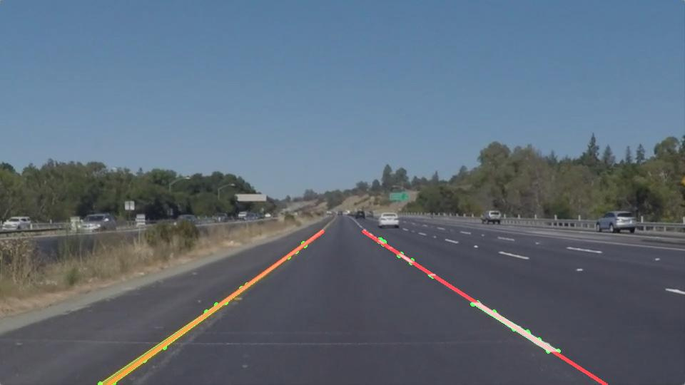

# **Finding Lane Lines on the Road** 

The objective of this project:

- Use computer vision to engineer and extract features and filtering criteria for identifying lane lines on the road.
- The output video is an annotated version of the input video.
- Left and right lane lines are accurately annotated throughout almost all of the video

## Contents
- [Analysing Data](#analysing-data)
- [Ideas](#ideas)
- [Image Processing Pipeline](#image-processing-pipeline)
- [Hyper-parameter tuning](#hyper-parameter-tuning)
- [Pipeline output](#pipeline-output)
- [Shortcomings](#shortcomings)
- [Further improvements](#further-improvements)

## Analysing Data

In the provided input sources, we have the following types of lanes

- Solid continuous white lane
- Banded/Overtake white lane (with circles between the bands)
- Solid continuous yellow lane
- **Challenge:** Handle abrupt changes in brightness/intensity of the road
- **Challenge:** Lane lines fading out around brighter parts of the road
- **Challenge:** Ignore the car's hood

## Ideas

#### Colour Selection
For our lane detection pipeline to perform optimally, we must clean, filter or transform the source input image so that the stages down the pipeline can work on only what matters - the lane pixel data.

We can run RGB colour selection on white and yellow lanes, but it fails when the lane pixels and pixels surrounding them have similar colour (as seen in the challenge video). This is because brightness is captured in all R, G & B channels and the colour selection threshold will capture similar pixels returning an incorrect colour mask and eventually resulting in incorrect edge detection.

A robust way is to select colours in the [Hue-Saturation-Brightness (HSB) colour space](https://en.wikipedia.org/wiki/HSL_and_HSV). This is because the colour is independent of the brightness in a separate channel. Here's a table explaining how we can filter out white and yellow colours.

| Color  | Hue             | Saturation | Brightness  |
| :----- | :-------------- | ---------- | :---------- |
| White  | Any (0 to 360)° | 0 to 5%    | 70% to 100% |
| Yellow | 30° to 70°      | > 30%      | > 30%       |

Interestingly, we can select both White & Yellow (including lighter/darker shades) just by adjusting the **Brightness** channel. On the other hand, we can cherry-pick which *colours* we want just by adjusting the **Hue/Saturation** channel.

#### Grayscale Conversion

For grayscale conversion, we want to make sure that we get the best results for our edge detection algorithm. Since the algorithm relies on detecting a change in intensity of a pixel, we want to make sure our lane pixels are brighter than the nearby pixels that got through the colour selection mask.

The grayscale image can be obtained by selecting one of Red, Green or Blue channels. The **Red channel** is well suited for this conversion because yellow and white are brighter and dark colours like tarmac & trees are much darker in the red channel grayscale. This means the change in intensity between lane & road will be higher for grayscale sourced from the Red channel. Here's an example showcasing this difference.


#### Hough Transform & Lane Lines

Having a small value of `min_line_length` can help detect the tiny details of the lanes, especially the small circles between the overtake bands.

To draw the lane lines we need to decide which Hough edges lie in which lane - left or right. An initial idea is to use the slope of the edge to decide the edge is a part of which lane. Since origin (0, 0) is top-left, edges with positive & negative slopes will be on the right & left lane respectively.

While this seemingly works, it's prone to errors - Hough detects short edges and a positive slope on the left lane will be incorrectly determined as right. To keep things simple, we'll segregate edges based on the location of the edge - left to the center of the image will be a part of the left lane or otherwise on of the right lane.

To account for cases like curved roads (like in the challenge video), we'll introduce a "deadzone" or an "offset" from the midpoint so that the points from the left lane are not incorrectly categorized as the right lane. 

To summarize,

- Hough edge is in the left lane if `HoughX < (CenterX - deadzone)`
- Hough edge is in the right lane if `HoughX > (CenterX + deadzone)`

To draw the lanes we can then average all the edges or fit a line from all the edges.


## Image Processing Pipeline

Based on the above analysis, the image processing pipeline goes through 7 stages to filter the content, extract features & process the image to draw lane lines on the road.

#### 1. Colour Selection

The first stage in the pipeline is to generate a colour masked clean image containing lane pixels.

Based on the above analysis, we need to convert the image to HSB colour space. In OpenCV, this colour space is called HSV (Hue-Saturation-Value) and the range of it is from (H0, S0, V0) to max (H179, S255, V255).

The pipeline stage function `color_select_hsv(img, lower, upper)`

- Take an RGB image and min/max HSV thresholds as input
- Converts it to HSV colour space
- Performs colour selection using cv2.inRange() & cv2.bitwise_and()
- Returns and the result in RGB colour space.

```python
def color_select_hsv(img, lower=(0, 0, 0), upper=(179, 255, 255)):
    """Color selection in HSV color space"""
    _img = cv2.cvtColor(img, cv2.COLOR_RGB2HSV)
    mask = cv2.inRange(_img, lower, upper)
    masked = cv2.bitwise_and(_img, _img, mask=mask)
    return cv2.cvtColor(masked, cv2.COLOR_HSV2RGB)
```

Here's how the output looks like when the `Vmin=210` and `Vmax=255`

| Source Image                                                 | Color Masked                                                 |
| ------------------------------------------------------------ | ------------------------------------------------------------ |
|  |  |
|  |  |
|  |  |

The last frame is from the challenge video reflects how effective the colour masking is even though the lane is fading in with the brighter road near the horizon.

#### 2. Convert to Grayscale

The second stage is to convert the image to grayscale for the edge detection algorithm to run from.

Instead of using the helper function `grayscale()`, we have a custom function `grayscale_channel()` that returns a particular channel from an RGB image.

```python
def grayscale_channel(img, channel=0):
    """Returns a channel (grayscale) from an image
       0 = Red
       1 = Green
       2 = Blue
    """
    return img[:, :, channel]
```

The result of selecting the red channel for grayscale

| White lane - Grayscale                                 | Yellow Lane - Grayscale                                 |
| ------------------------------------------------------ | ------------------------------------------------------- |
|  |  |

#### 3. Apply Blur

This stage applies Gaussian blur to smooth out the noise from the image & the helper function  `gaussian_blur()` is used here.

We want to make sure that our blur is good enough to an extent that small important details like the small circles in the white overtake lanes are preserved.

| White lane - Blurred                              | Yellow Lane - Blurred                              |
| ------------------------------------------------- | -------------------------------------------------- |
|  |  |

#### 4. Edge Detection

This stage takes the blurred image and runs the Canny Edge Detection algorithm on it to figure out edges in the image.

Since we have already filtered out a lot of edges in the colour selection step, the output of this step is almost always clean.

The helper function `canny()` is used for detecting the edges.

| White lane edges                                   | Yellow Lane edges                                   |
| -------------------------------------------------- | --------------------------------------------------- |
|  |  |

In the output image, you can see that the lane lines and tiny details like the small circles are well preserved

#### 5. Apply mask

This stage clips an image by applying a polygon mask. 

The points required for the polygon mask are generated by a custom function `lane_mask_quad()`. The function accepts two parameters`top_width` and `offset_top` which adjust the width and offset of the top edge of the polygon.  The bottom edge of the polygon is fixed to the edges of the image as shown in the image. 


This quad mask along with the image is passed to the helper function `region_of_interest(img, mask_vertices)`

| White lane edges masked                           | Yellow Lane edges masked                           |
| ------------------------------------------------- | -------------------------------------------------- |
|  |  |

#### 6. Hough Lines + Draw Averaged Lanes

The stage is responsible for generating Hough transform lines and draw the averaged extrapolated lane lines.

##### Hough Lines

The helper function `hough_lines()` is used for taking in the masked edges and generating Hough lines. It's been slightly modified to accept any custom draw function - to extend the lane drawing functionality.

##### Lane Lines

The custom `draw_lanes()` function is passed to the customised `hough_lines()` function to render the lanes.

First it segregates all the Hough edges based on their location on the image

```python
left_deadzone = int(max_x / 2) - deadzone
right_deadzone = int(max_x / 2) + deadzone
if (x1, x2) < (left_deadzone, left_deadzone):
	coords = left_coords
elif (x1, x2) > (right_deadzone, right_deadzone):
	coords = right_coords
else:
	continue

# Append both co-ords to the selected lane list
coords.append((x1, y1))
coords.append((x2, y2))
```

To draw the lane line, 

- Generate an averaged line using the left/right Hough Edges
- Draw the lane line from the top of the region of interest mask to the bottom of the image which

To generate an averaged line, we simply fit a line using all the co-ordinates of Hough edges using `np.polyfit()`. We then find the intercepts to the top of the region mask and bottom of the image by using the `np.poly1d(polyfit_result)`

```python
# Fit two lines for left_coords & right_coords using "polyfit".
# "poly1d" will return a "line-function" for the polyfit
left_line = np.poly1d(np.polyfit(left_coords[1], left_coords[0], deg=1))
right_line = np.poly1d(np.polyfit(right_coords[1], right_coords[0], deg=1))

# Resolve intercept points for the averaged lane line using the "line-function"
left_p1 = np.array([left_line(min_y), min_y], dtype=np.uint)
left_p2 = np.array([left_line(max_y), max_y], dtype=np.uint)
right_p1 = np.array([right_line(min_y), min_y], dtype=np.uint)
right_p2 = np.array([right_line(max_y), max_y], dtype=np.uint)
```

Finally, we use these intercepts to draw the line.

```python
cv2.line(img, left_p1, left_p2, color=lane_color, thickness=lane_thickness)
cv2.line(img, right_p1, right_p2, color=lane_color, thickness=lane_thickness)
```

The following render illustrates how lane building works

- Hough generates the edges (green dots connected with green lines)
- The dead-zone in the middle (cyan lines) decides if the edges are in left lane or right
- The averaged lane is generated (red line)


## Hyper-parameter tuning

With multiple algorithms processing the image, finding the perfect result on all of the input sources requires multiple iterations & fine-tuning.

I've created a visualiser tool to simplify this process and experiment quickly. We can tweak all the critical parameters for tuning our pipeline like

- HSV colour selection lower & upper thresholds.
- Gaussian Blur filter size.
- Canny edge detection lower & upper thresholds.
- Hough transform rho, thresholds, min length & max gap.


Considering all the input sources, including the challenge video, the final hyper-parameters used for this pipeline are

- HSV thresholds: `min=(15, 0, 210)` & `max=(179, 255, 255)`
  - `Hmin=15` makes sure that we preserve colours starting from yellow.
  - `Vmin=210` makes sure we only capture bright pixels like yellow & white lanes .
- Gaussian Blur kernel: `k=7`
- Canny Edge thresholds: `min=50` & `max=150`
  - A decent 1:3 ratio for detecting edges.
- Hough Transform: `rho=2` ,`theta=π/180` , `threshold=20` `min_line_length=2`, `max_line_length=20`
  - The `min_line_length` is set to **2** to capture the smaller shapes like the circles in banded overtake lanes.
  - The `max_line_length` is set to **20** so that lane markers near the horizon can be grouped up as a line segment.

## Pipeline output

Based on the draw parameters, the final output contains both segmented lane line & averaged/extrapolated lane lines

|  |  |
| ------------------------------------------------------------ | ------------------------------------------------------------ |
|  |  |
|  |  |
|  |  |

Video output:

- [solidWhiteRight.mp4](https://giant.gfycat.com/MellowSoreArmadillo.mp4)
- [solidYellowLeft.mp4](https://giant.gfycat.com/LegalSecondhandAcornweevil.mp4)
- [challenge.mp4](https://giant.gfycat.com/EthicalDecimalIndianpalmsquirrel.mp4)

## Shortcomings

There's a couple of places where the pipeline falls behind

- In cases where the car is on a curved road ([challenge.mp4](./test_videos_output/challenge.mp4)), the current implementation results in incorrect lane lines. This is because the lane lines are generated using a Linear Polynomial function which always results in a straight line.
- Any abrupt changes in the brightness/colour intensity of the tarmac can cause the Canny edge detection to generate new sets of edges.
- The extrapolated/averaged lane lines are sensitive to such random edges and results in jittery movement of the lanes.
- Colour selection parameters for `cv2.inRange()` leads to loss of information. What works in one input source may not work for another.
- If any car, especially the ones that have Yellow/White paint in the region of interest, can interfere with the pipeline resulting in incorrect lane lines.

## Further improvements

- Average end-points of the lane lines over multiple frames to stabilize the lines.
- "Normalize" the image to account for abrupt changes in brightness/contrast/colour intensity of the road. This will also minimize any errors when colour masking across different input sources.
- The lane lines can be updated to draw a curved line (polynomial of degree 2 or more) using `np.polyfit(..., deg=n)`. The only caveat here is that there should be enough Hough edges to generate a stable curved line.

## Code

Both the [P1.ipynb](./P1.ipynb) and [pipeline.py](./pipeline.py) files share the same code with **one exception**. The `lane_detection_pipeline()` function is slightly tweaked to support the GUI tool use-cases.
